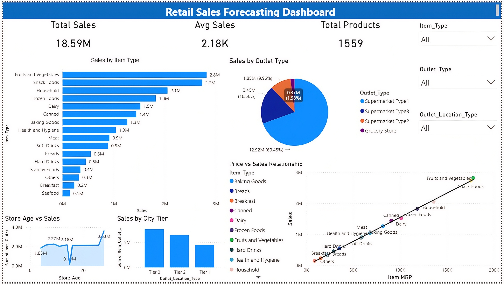

# Retail Sales Forecasting & Business Analytics Dashboard

## Project Overview

This project analyzes retail sales data and builds a machine learning model to predict product sales. The project also includes a Power BI dashboard to visualize sales insights and support business decision making.

The goal of this project is to demonstrate how data science and business analytics can help retailers understand product demand patterns and optimize sales strategies.

---

## Technologies Used

Programming Language:
- Python

Libraries:
- Pandas
- NumPy
- Scikit-learn
- Matplotlib

Tools:
- Jupyter Notebook (Anaconda)
- Power BI

---

## Machine Learning Models

Two regression models were implemented:

1. Linear Regression  
2. Random Forest Regressor  

Dataset split:
- 80% Training
- 20% Testing

Model evaluation metrics used:

- RMSE (Root Mean Squared Error)
- R² Score

---

## Dataset Information

Dataset: BigMart Retail Dataset

Total Records: **8523**

Important features:

- Item_Type
- Item_MRP
- Item_Visibility
- Outlet_Type
- Outlet_Location_Type

Target variable:

---

## Project Structure
Retail_Forecasting_Project
│
├── data
│ ├── raw
│ └── processed
│
├── notebooks
│ ├── 01_data_preprocessing.ipynb
│ └── 02_model_training.ipynb
│
├── models
│ └── sales_prediction_model.pkl
│
├── dashboard
│
├── reports
│ ├── Dashboard.pbix
│ ├── Dashboard.png
│ ├── Retail-Sales-Forecasting-and-Business-Analytics.pdf
│ └── Retail-Sales-Forecasting-and-Business-Analytics.pptx

---

## Dashboard Insights

Key insights obtained from the Power BI dashboard:

- Fruits and Vegetables generate the highest sales
- Tier 3 cities produce the highest revenue
- Higher product price (MRP) is strongly correlated with higher sales
- Supermarket Type 1 contributes the largest share of sales

---

## Dashboard Preview

---

## Conclusion

This project demonstrates how machine learning and data visualization techniques can be used to analyze retail sales patterns and support business decision making. Combining predictive models with interactive dashboards helps organizations gain actionable insights from their data.

---

## Author

Om Yadav  
MCA – Bharati Vidyapeeth Institute of Management & Information Technology  
Navi Mumbai